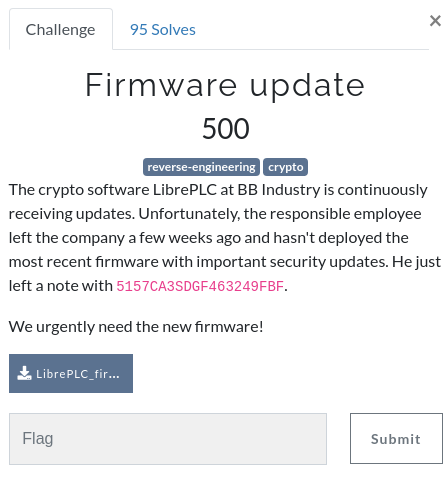
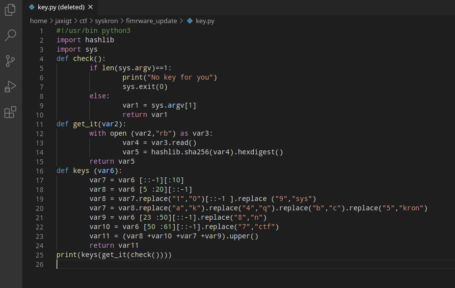

# Firmware Update

 

 


## Details



First we download, the file an unzip it. 
This presents us with 3 further zip files;

```
[jaxigt@MBA firmware_update]$ unzip LibrePLC_firmware_pack.zip
Archive:  LibrePLC_firmware_pack.zip
 extracting: LibrePLC_fw_1.0.0.zip   
 extracting: LibrePLC_fw_1.0.1.zip   
 extracting: LibrePLC_fw_1.0.2.zip 
 ```

Next we try to unzip the first file and we are prompted for a password 

```
[jaxigt@MBA firmware_update]$ unzip LibrePLC_fw_1.0.0.zip 
Archive:  LibrePLC_fw_1.0.0.zip
[LibrePLC_fw_1.0.0.zip] LibrePLC_fw_1.0.0.bin password: 
```

Let's try using the note provided in the challenge details as the password ("**5157CA3SDGF463249FBF**").

```
[jaxigt@MBA firmware_update]$ unzip LibrePLC_fw_1.0.0.zip 
Archive:  LibrePLC_fw_1.0.0.zip
[LibrePLC_fw_1.0.0.zip] LibrePLC_fw_1.0.0.bin password: 
  inflating: LibrePLC_fw_1.0.0.bin   
  inflating: key                     
```

This appears to work and gives us a further 2 files; "**key**" and "**LibrePLC_fw_1.0.0.bin**".

Let's try unzipping the other zip files with the same pasword;

```
[jaxigt@MBA firmware_update]$ unzip LibrePLC_fw_1.0.1.zip 
Archive:  LibrePLC_fw_1.0.1.zip
[LibrePLC_fw_1.0.1.zip] LibrePLC_fw_1.0.1.bin password: 
password incorrect--reenter: 
```

OK, so we can see that those fiels will require a different password. Let's look at the  files we just extracted.

Running the "**file**" command on these two files show us the following;

```
[jaxigt@MBA firmware_update]$ file key LibrePLC_fw_1.0.0.bin 
key:                   Python script, ASCII text executable
LibrePLC_fw_1.0.0.bin: data
```

We can see that the "**key**" file is just "**ascii text**" and most likley a "**python script**" so lets take a closer look at that before moving on the "**.bin**" file.

```python
#!/usr/bin python3
import hashlib #line:3
import sys #line:4
def check ():
        if len (sys .argv )==1 :#
                print ("No key for you")#
                sys .exit (0 )#line:9
        else :#line:10
                OOO0OOOOOO00000OO =sys .argv [1 ]#
                return OOO0OOOOOO00000OO #line:12
def get_it (OOO0OOOOO00000OOO ):#line:14
        with open (OOO0OOOOO00000OOO ,"rb")as O0000O000O00O0000 :#line:15
                O0O0O0OOO000OOO0O =O0000O000O00O0000 .read ()
                OO0O000O0OO000O0O =hashlib .sha256 (O0O0O0OOO000OOO0O ).hexdigest ()
        return OO0O000O0OO000O0O #line:18
def keys (OOOOOOOO00OOOOOOO ):#line:20
        O0OO00OOO00OOOOOO =OOOOOOOO00OOOOOOO [::-1 ][:10 ]#line:21
        O00O00O0O0O0O0000 =OOOOOOOO00OOOOOOO [5 :20 ][::-1 ]#line:22
        O00O00O0O0O0O0000 =O0OO00OOO00OOOOOO .replace ("1","0")[::-1 ].replace ("9","sys")#
        O0OO00OOO00OOOOOO =O00O00O0O0O0O0000 .replace ("a","k").replace ("4","q").replace ("b","c").replace ("5","kron")#line:24
        O0O000OO0000O000O =OOOOOOOO00OOOOOOO [23 :50 ][::-1 ].replace ("8","n")
        O0OO0OO0OOOOO0OO0 =OOOOOOOO00OOOOOOO [50 :61 ][::-1 ].replace ("7","ctf")#
        O0OO00O00000O00O0 =(O00O00O0O0O0O0000 +O0OO0OO0OOOOO0OO0 +O0OO00OOO00OOOOOO +O0O000OO0000O000O ).upper ()#
        return O0OO00O00000O00O0 #line:30
print (keys (get_it (check ())))
```

From looking at this file we can determine that the script expects to be passed an argument, then opens a file and reads it as binary before performing "**sha256**" and "**hexdigest**" functions on some data, as well as "**replacing**" some characters with different ones.

Let's try running the script to see what happens;

```
[jaxigt@MBA firmware_update]$ python key
No key for you
```

As expected, we've not passed it an argument, so it just returns "**No key for you**".

Going back to the scripts code, while at first clance it might look like the variables names are all the same (a string of 18x 0's) or have been redacted if you look closely you will notice that some are the capital letter ""**O**" while others are number"**0**". 

I open the file in visual Studio Code to make ediiting a little easier and replace all of the variables which are the same with a variable name to make the code more readable and tidy up some spacing;



Ok now the code is a little easier to read, we can see that the script needs to be passed a file as an argument which it will open and read as binary before perfoming functions on the read data and returning a value that is printed to the screen.

The only files we have to work with are the zip files and the recenetly unziped "**LibrePLC_fw_1.0.0.bin**".

So lets try running the python script and passing the "**LibrePLC_fw_1.0.0.bin**" as an argument, to see if that gives us a new output;

```
[jaxigt@MBA firmware_update]$ python key LibrePLC_fw_1.0.0.bin 
7SYSCC3076BDCTF13CC9CTFA6CB7SYSCC3076CD56579549EC5AB533EN03AFC1F9N
```

And it does!

> I should point out that it is not neccessary to beautify the code and replace the variable names. Running the original script would produce the same output, but I wanted to understand what the code was doing!

So now let's try using this new string as the password to unzip the next file;

```
[jaxigt@MBA firmware_update]$ unzip LibrePLC_fw_1.0.1.zip 
Archive:  LibrePLC_fw_1.0.1.zip
[LibrePLC_fw_1.0.1.zip] LibrePLC_fw_1.0.1.bin password: 
  inflating: LibrePLC_fw_1.0.1.bin  
```

And it works. We have a new file called "**LibrePLC_fw_1.0.0.bin**", but no key file this time.

Again, before analysing the new binary file, let's first try runnining the same "**key.py**" script against this new "**.bin**" file.

```
[jaxigt@MBA firmware_update]$ python key LibrePLC_fw_1.0.1.bin 
CSYS0BBA60E46ABB19C5BC0CSYS0CCK60EQ1NC41E2C5DDA4C5C7D45E096162
```

And now we have another string.... let's try unzipping the final file with this new string;

```
[jaxigt@MBA firmware_update]$ unzip LibrePLC_fw_1.0.2.zip 
Archive:  LibrePLC_fw_1.0.2.zip
[LibrePLC_fw_1.0.2.zip] LibrePLC_fw_1.0.2.bin password: 
  inflating: LibrePLC_fw_1.0.2.bin 
```

We have sucessfully unzipped all three files! Nice!!!

But wait... we still dont have a flag!?! Perhaps we finaly need to dissasemble or debug the "**.bin**" files?

Before we do though, let's try some basics..

Running the "**file**" command against the "**.bin**" files doesnt give us much to go on;

```
[jaxigt@MBA firmware_update]$ file LibrePLC_fw_1.0.2.bin 
LibrePLC_fw_1.0.2.bin: data
```

Before we jump into "**radare2**" though, we'll check some final low-hanging fruit... let's check from **strings over 8 characters long**;

```
[jaxigt@MBA firmware_update]$ strings -n 8 LibrePLC_fw_1.0.2.bin 
syskronCTF{s3Cur3_uPd4T3}
*mh||`r,
wN'8S.`I\
sN_vbr|j
`%y3?_\>s
"Qw"9-f '
<{4P5%HXd
KvSF8.ar
'2[=.o%$
x:-nFiC 
$)| ,6Zv
<z88Z!Y#!T
bn{IJQw}Si
D~MhpM2)
yUttd1u-
^|G|e2NJ
`T3XU^tGm
.Zn{3!b#
Bf/_\835
!`O'R 2j
jC GKBvS
x{zjHj(6
r ?H~wPog
}[9AxvcD
        vxJKDh|*-
1<F 3^\>1
>GR06V-`P=`
1n4j0aR-
+uxU,h^&:
Rsn     L UA
:Bwm$Vsx
-&#}t:rnH
hV^e}uqn
vxeJAWGoRl
*FkKw={s
^0YS9Ushj!
mb0-!DWp
9eY@W(>x
_<Gtiuhgl
mZv$=\jp"
c30:+FH+%
K*8tGzE:T
 O*?](0N
81f.{&iq
RvD=l0~x
(F*wVK#S#
K'B1Yhq:
f+LX4Z('
jb4f&d2Z{
kY#@`4'zR
~2(:hU4f
```

Bingo!

Right at the top of the strings output we have the flag for which is **syskronCTF{s3Cur3_uPd4T3}**
