# Key Generator

 

## Details

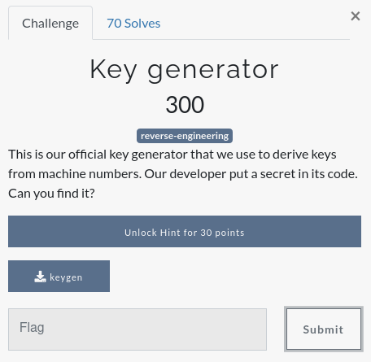

After downloading we first erun the binaryv to try and understand what it is doing. It seems to ask for some input (a machine number) and then returns if its valid.

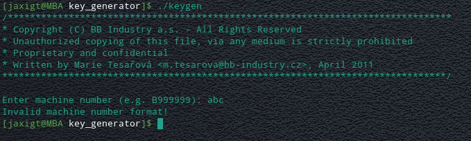

Running it again and entering the suggested example "Machine Number" we can see a differnet output.

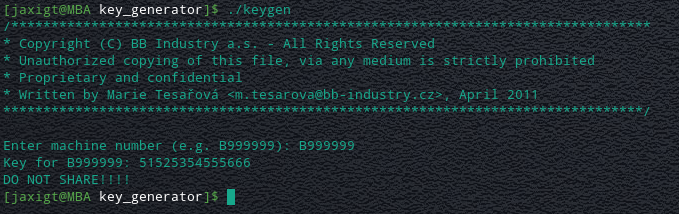

Ok lets open this up in radare2 and analyse it!
We start by running "**aaa**" to analyse and autoname functions.
Next we run "**afl**" to list the discovered functions.
Heer we can see the function "**main**" which is usualy a good place to start, so we use the command "**s main**" to seek to main and the "**VV**" to open visual view. (if your view doesnt look like the below press the "**P**" key to cyle through the visual display options.

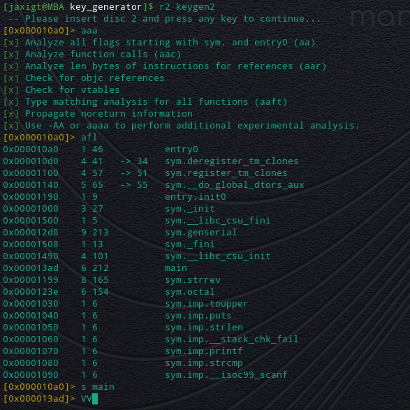

Ok so lets start looking through the main function tio see if we can understand whats going on.

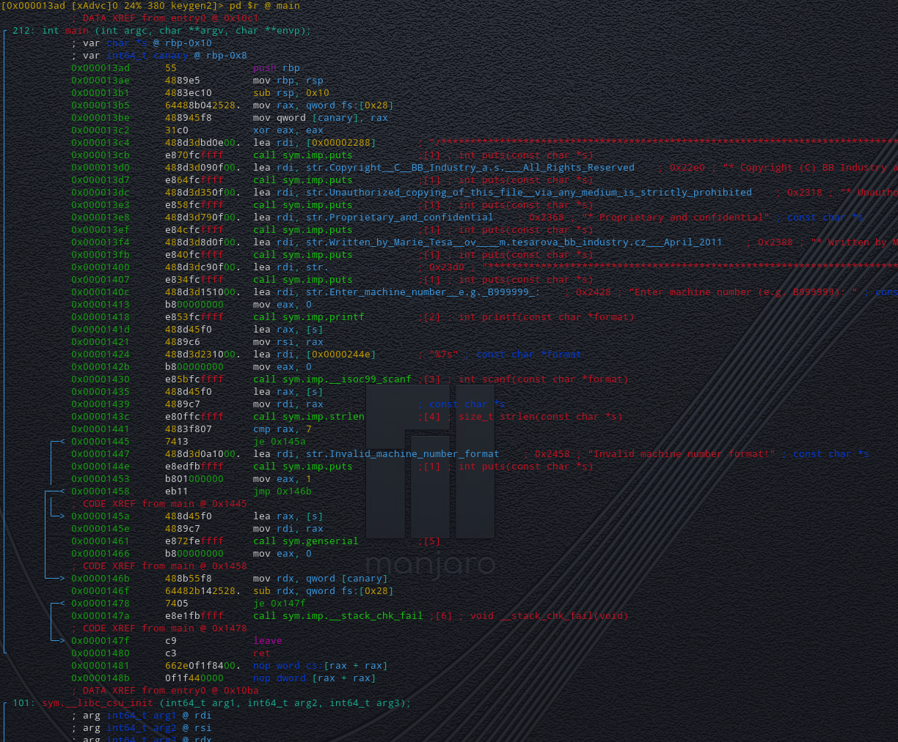

It looks as though lost of information is being output using the "**puts**" function befor asking for an input and then calling the function "**sym.imp.strlen**" on that value. It appears the value is then compared to see if it is equal to 7 (characters long) before jumping to another part of the code if it is.
So that now explains how the **"Valid machine Format"** check is taking place!

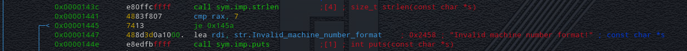

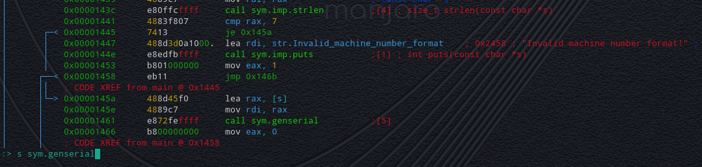

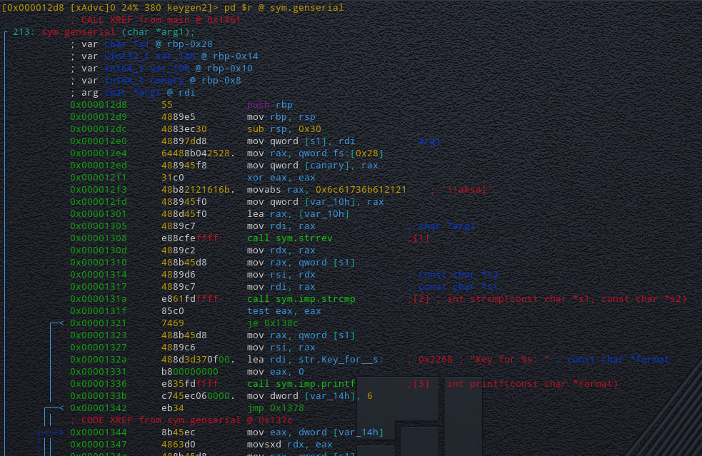

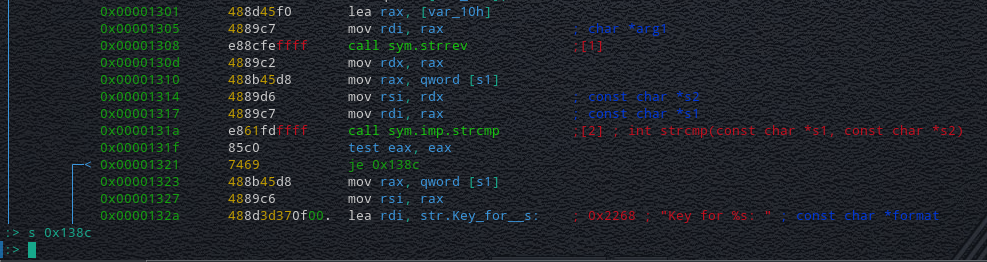

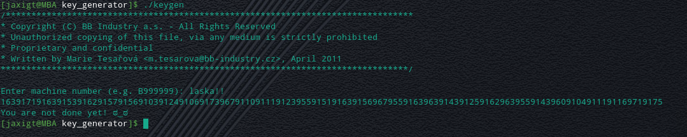

Now back in radare there is another clue to what might be going on here, after returnign from the **genserial** function another clal is made to a function called **octal**.

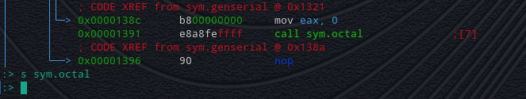

Rather than trying to dissassemble this funtion in Radare2, we instead can jump over to an online Ascii Conversion Tool, [dcode.fr](https://www.dcode.fr/ascii-code).
Putting the string into the inpit box and hitting decrypt  shows the flag on the left and sure enough, the Ascii conversion methos is listed as "**OCT (N Digits)**"
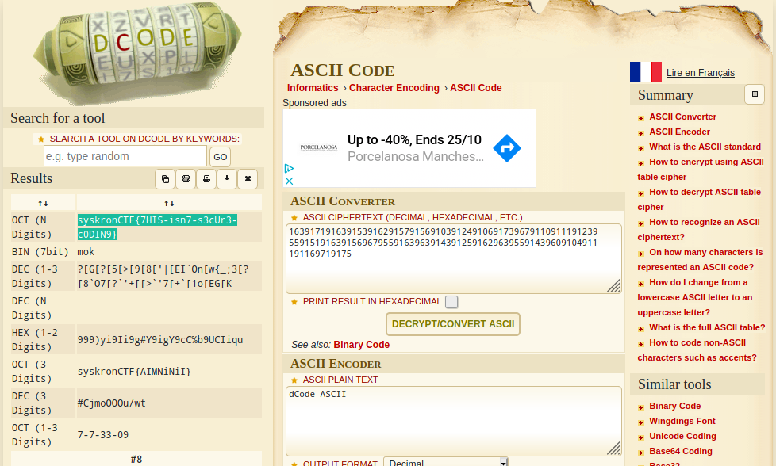

**syskronCTF{7HIS-isn7-s3cUr3-c0DIN9}**

