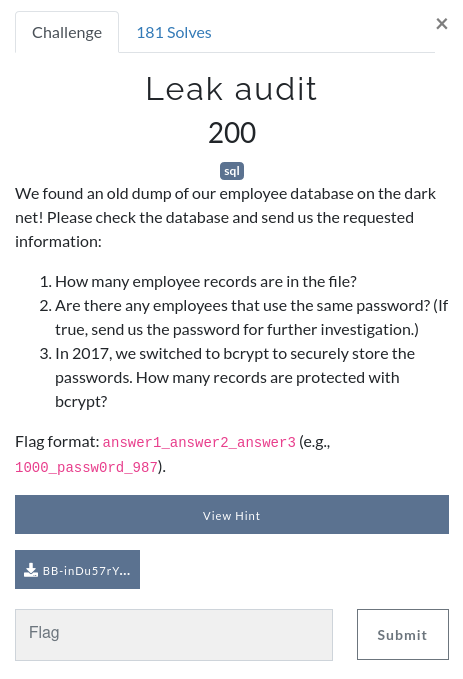

# Leak audit

 


## Details


After downloading and extracting the file we see a .db extension, running the file command on it confirms it's a SQLLite Database.

```
>$ file BB-inDu57rY-P0W3R-L34k3r2.db
BB-inDu57rY-P0W3R-L34k3r2.db: SQLite 3.x database, last written using SQLite version 3033000
```

I'm much moref comfortable with MySQL so i head to teh website [RebaseData.com](https://www.rebasedata.com/convert-sqlite-to-mysql-online) to convert it.


I download the converted file, move it from my Downloads folder and unzip it.

```
>$ mv ~/Downloads/result.zip .
>$ unzip result.zip 
Archive:  result.zip
  inflating: data.sql
```

Next we need to create a blank MySQL databse to write the dumped database into;

```sql
>$ sudo mysql
Welcome to the MariaDB monitor.  Commands end with ; or \g.
Your MariaDB connection id is 4
Server version: 10.5.5-MariaDB Arch Linux

Copyright (c) 2000, 2018, Oracle, MariaDB Corporation Ab and others.

Type 'help;' or '\h' for help. Type '\c' to clear the current input statement.

MariaDB [(none)]> CREATE DATABASE leak_audit;
Query OK, 1 row affected (0.000 sec)

MariaDB [(none)]> exit
Bye
```

Back outside of MySQL we can import the database like below;

```
>$ sudo mysql -p leak_audit < data.sql 
Enter password: 
```

Now we head back in MySQL client and select the database;

```sql
>$ sudo mysql
Welcome to the MariaDB monitor.  Commands end with ; or \g.
Your MariaDB connection id is 9
Server version: 10.5.5-MariaDB Arch Linux

Copyright (c) 2000, 2018, Oracle, MariaDB Corporation Ab and others.

Type 'help;' or '\h' for help. Type '\c' to clear the current input statement.

MariaDB [(none)]> use leak_audit;
Reading table information for completion of table and column names
You can turn off this feature to get a quicker startup with -A

Database changed
```
Lets have a look at what tables are in the database;

```sql
MariaDB [leak_audit]> show tables;
+----------------------+
| Tables_in_leak_audit |
+----------------------+
| personal             |
| sqlite_sequence      |
+----------------------+
2 rows in set (0.000 sec)
```

OK, that's nice and simple and we're only interested in the "personal" table, so lets try outputing a few rows to see what the data looks like;

```sql
MariaDB [leak_audit]> select * from personal LIMIT 5;
+--------+-------------+------------+-------------------+-----------------+---------+-------------+-----------+
| number | surname     | givenname  | streetaddress     | city            | zipcode | password    | birthday  |
+--------+-------------+------------+-------------------+-----------------+---------+-------------+-----------+
|      1 | Beck        | Josef      | U Parku 1120      | Dívcice         | 373 48  | xenia5AhQu  | 8/29/1989 |
|      9 | Jaroš       | František  | Lomená 482        | Plavec u Znojma | 671 32  | uvaiK2ch    | 5/5/1962  |
|     17 | Smékalová   | Jana       | Hájecká 1528      | Lidice          | 273 54  | iMagh0tae4e | 4/13/1992 |
|     25 | Mrózková    | Tereza     | Partyzánská 549   | Rasošky         | 552 21  | Bi8iSha9    | 10/2/1974 |
|     33 | Parák       | Libor      | Družstevní 1694   | Rakvice         | 691 03  | ni2uBot4ey  | 9/22/1984 |
+--------+-------------+------------+-------------------+-----------------+---------+-------------+-----------+
5 rows in set (0.000 sec)
```
So the first bit of info we need to find to build our flag is the "**number of employee records in the file**". We can find this like so;

```sql
MariaDB [leak_audit]> select count(number) from personal;
+---------------+
| count(number) |
+---------------+
|           376 |
+---------------+
1 row in set (0.000 sec)
```
So now we have teh first part of our flag, next we need look for "**duplicate passwords**"... we can do this with the below SQL query;

```sql
MariaDB [leak_audit]> SELECT password, COUNT(password) FROM personal GROUP BY password HAVING COUNT(password) > 1;
+------------+-----------------+
| password   | COUNT(password) |
+------------+-----------------+
| mah6geiVoo |               2 |
+------------+-----------------+
1 row in set (0.001 sec)
```
The final piece of information we need to look for is "**passwords protected with bcrypt**". I happen to know that BCrypt passwords start with $2a$ or $2b$ but if you didint know this information a quickj check google can reveal this information;
[https://en.wikipedia.org/wiki/Bcrypt](https://en.wikipedia.org/wiki/Bcrypt)

```sql
MariaDB [leak_audit]> SELECT * FROM personal where password LIKE "$2a$% OR password LIKE "$2b$%";
+--------+---------------+-----------+-----------------------+--------------------------------+---------+--------------------------------------------------------------+------------+
| number | surname       | givenname | streetaddress         | city                           | zipcode | password                                                     | birthday   |
+--------+---------------+-----------+-----------------------+--------------------------------+---------+--------------------------------------------------------------+------------+
|   2841 | Horváth       | Petr      | Jiráskova 450         | Predmerice nad Jizerou         | 294 74  | $2b$10$/dd1tLbClIU85/pkthZvee9NvDvOYADy6/iSXGIEQxSVAhvRSASj6 | 3/10/1975  |
|   2849 | Svoboda       | Aleš      | U Křížku 648          | Habartice u Frýdlantu          | 463 73  | $2b$10$pNw9RC6ZRQgmEqOfc.wJ5.viFuoisuN0qDk/vPJwByGc61uOPdhqu | 1/29/1993  |
|   2857 | Lebedová      | Pavlína   | Louny 423             | Louny 1                        | 440 01  | $2b$10$H7eXD6v6e8k69.n80zwuC.d/DwkMx3KBcysW/t/sWVV.jNnwUsNOK | 8/19/1977  |
|   2865 | Volf          | Aleš      | Českého odboje 1084   | Pardubice 2                    | 530 02  | $2b$10$RK7/J20lpsYKI5XwaQRfFuuDD7dco3pdriuHqW2rGQJhdZNxh27Tm | 3/3/1984   |
|   2873 | Králová       | Veronika  | Jičín 1466            | Jicín 1                        | 506 01  | $2b$10$5vU.ciW1T8sRSn9UmrWuRe3caFv3Qf5ZPhQ88pJWjME2mcjIPAksS | 5/27/1971  |
|   2881 | Veselá        | Jiřina    | U Parku 1191          | Hluboká nad Vltavou            | 373 41  | $2b$10$Aa2NmhGgZ54MVzbO7TFfXuLTKLnZqSRymkaAzUcFdySUtE/obSHhu | 3/3/1997   |
|   2889 | Kubeš         | Tomáš     | Bezručova 1306        | Sudkov                         | 788 21  | $2b$10$dAJ0Luxo/aWSI4EJm7Fage.aFYeUadmKP1yz1nz9BwBYdU86gTSKy | 2/8/1995   |
|   2897 | Pavlík        | Mario     | Za humny 431          | Bernartice u Milevska          | 398 43  | $2b$10$5VRLne6dbC.qgBrnj9AFTeXpWn6Hkiv2UIUepqCChNOE2YmMCp5qm | 4/21/1966  |
|   2905 | Novotný       | Jiří      | V Aleji 1886          | Cheb 2                         | 350 02  | $2b$10$MuQfDGPfyyQcXgUocF6Le.CADib1eZLonuQQ0HJFMsCCII//qIqNa | 1/12/1996  |
|   2913 | Stuchlík      | Jiří      | Mlýnská 998           | Ždár nad Sázavou 1             | 591 01  | $2b$10$PaOeIQLIylepTFWHO9YEmeDfrdS1qrl2t9WjPi/vmj8poQrBcqhyO | 2/9/1967   |
|   2921 | Kabourek      | Pavel     | Jana Nerudy 1172      | Horka u Staré Paky             | 512 34  | $2b$10$7KhXRvT05s2UG7dbol93tu/l.XAZto42/Uk8.jx67HOwNkaKX0h7O | 11/20/1977 |
|   2929 | Petr          | Jiří      | Na Výsluní 1583       | Planá u Mariánských Lázní      | 348 15  | $2b$10$IQpy9/a0OEXTf359F6fHhOB4mrHvT/eN.0cqVCiqN4usBoTy6rmQa | 4/19/1986  |
|   2937 | Veselá        | Jaroslava | Klímova 206           | Zruc nad Sázavou 1             | 285 22  | $2b$10$UGuvppmaOjpvrIBwwIzl8./89b6sSq9klPogIbHYvIXF13uHqAR/6 | 4/30/1969  |
|   2945 | Pražák        | Antonín   | Lesní 1738            | Jablonné nad Orlicí            | 561 64  | $2b$10$W301rAhAVwXxpuc4CDr/GOzaLac89vmww/pGTXSmU3PpZYQLvRLr6 | 1/2/1962   |
|   2953 | Lisa          | Michal    | Školní 1488           | Kaplice 1                      | 382 41  | $2b$10$1YdjEQ97.itIoDM3WQLBZORGQJuekq6OYFwaB6actkNzJZyU3ZFUy | 4/24/1964  |
|   2961 | Tomešková     | Jana      | Žerotínova 1461       | Havlíckuv Brod 1               | 580 01  | $2b$10$kF.RvjmgSAsr2n1Hqinan.Q/U0qCI/vmRWLQnd/SzIk03F5O4PSfm | 7/26/1990  |
|   2969 | Hynková       | Pavlína   | Luční 254             | Bystrice nad Pernštejnem       | 593 01  | $2b$10$OcMJ7tVeq1DPp5.kMEc1dOUoGv80K1md.htz9ono8CKgUwhpVZzWe | 8/13/1991  |
|   2977 | Drechslerová  | Blanka    | Bratří Čapků 1108     | Bílá Tremešná                  | 544 72  | $2b$10$qBUASyayom2M2YPwYXjXquRD4aQPC8An0T5cN3qZRtaqU6b0ZrJJ6 | 6/25/1983  |
|   2985 | Dlouhý        | Josef     | Družstevní 789        | Smecno                         | 273 05  | $2b$10$E2xOyW.c.StyCHjK5auzeOvN4j4cavd/OjrY/4gK8LyQ0/pSNFzli | 1/23/2001  |
|   2993 | Krkoška       | Tomáš     | Suhrady 1236          | Hat u Hlucína                  | 747 16  | $2b$10$qetsy5COAW9/zlUBLgXdkeHKKzq0E86vudbAoyevmQRdDt3Mcq4TK | 8/24/1958  |
|   3001 | Kukačka       | Michal    | Václava Haňky 1198    | Rajhrad                        | 664 61  | $2b$10$H7bpJOSIguADfqQ/QJWEn.mXgOhmpKU83ycvyIENiChHarlPn0oa2 | 11/16/1960 |
+--------+---------------+-----------+-----------------------+--------------------------------+---------+--------------------------------------------------------------+------------+
21 rows in set (0.001 sec)
```
So now we have the count of 21 records, we have all the info needed to submit the flag. putting all the information tother we get a flag of;

***syskronCTF{376_mah6geiVoo_21}***

