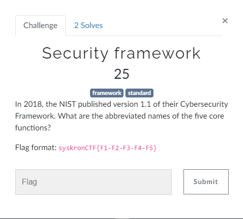
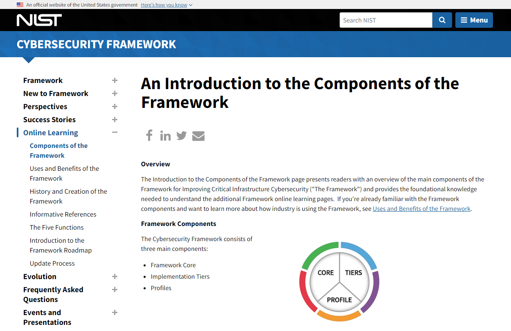
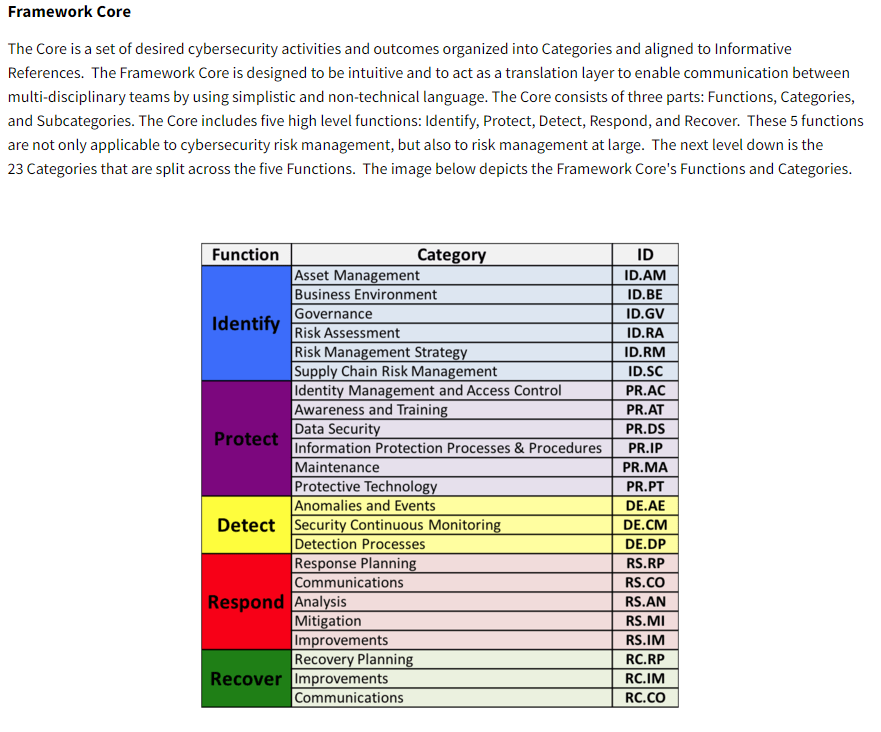

# Security Framework

 

  

## Details

A quick check of the [https://www.nist.gov](https://www.nist.gov/cyberframework/online-learning/components-framework#:~:text=Framework%20Core,-The%20Core%20is&text=The%20Core%20includes%20five%20high,to%20risk%20management%20at%20large.) finds the folowing page ;

A bit further down the page we see the folowing table;

So the Flag for this challenge is;

**syskronCTF{ID-PR-DE-RS-RC}**
