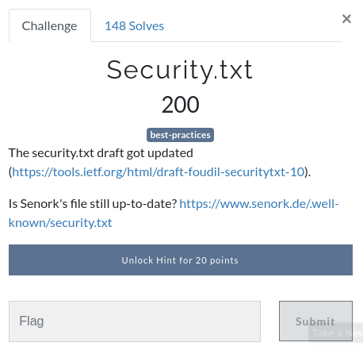
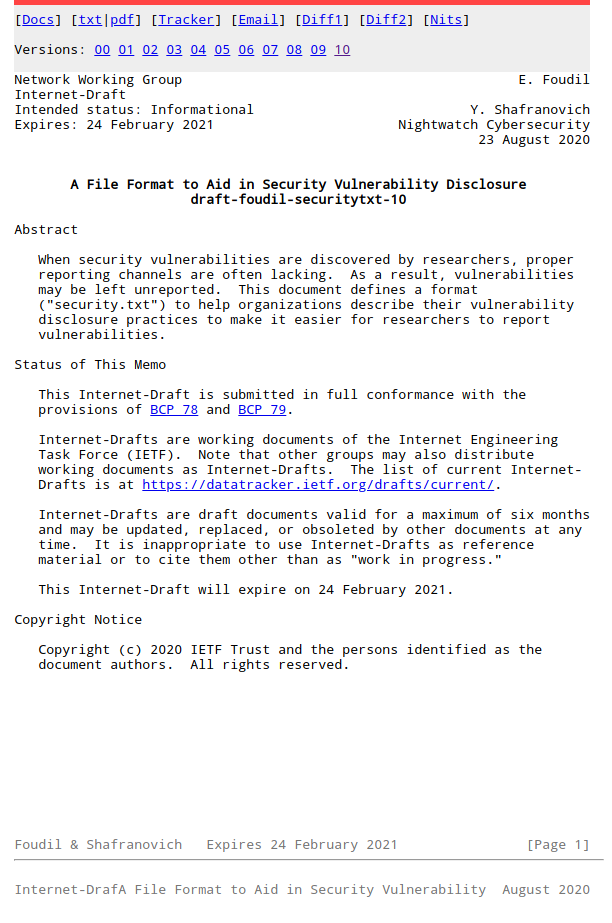
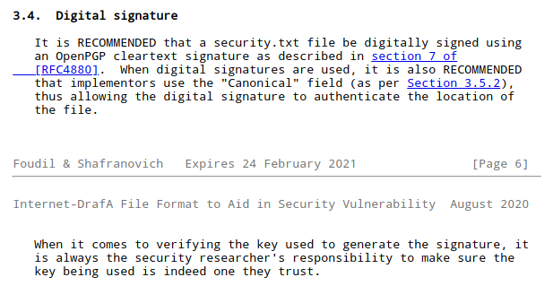

# Security.txt

 


## Details


First we start by opening the two links.

The first link ([https://tools.ietf.org/html/draft-foudil-securitytxt-10](https://tools.ietf.org/html/draft-foudil-securitytxt-10))takes us to a draft of the version 10 standard for Security Vulnerability Disclosure through a **security.txt** file.



The second link ([https://www.senork.de/.well-known/security.txt](https://www.senork.de/.well-known/security.txt)) takes us to a copy of Senork's published secuirty.txt file, which can be seen below;

```
-----BEGIN PGP SIGNED MESSAGE-----
Hash: SHA512

# Canonical URL
Canonical: https://www.senork.de/.well-known/security.txt

# Our security policy
Policy: https://www.senork.de/security/

# Our security acknowledgments page
Acknowledgments: https://www.senork.de/security/#acknowledgments

# Our security address
mailto:psirt@bb-industry.cz

# Our OpenPGP key
Encryption: https://www.senork.de/openpgp.asc

# Preferred languages
Preferred-Languages: en, cs

# Expiring date of this file
Expires: Thu, 31 Dec 2020 20:00:00 +0100
-----BEGIN PGP SIGNATURE-----

iHUEARYKAB0WIQQb0Dqaer1Y3W4NxowpcUAVAB/owgUCX1IefAAKCRApcUAVAB/o
wspjAQDDgE/cHebpoJQKIFVQukVWoNThA+53Pv7nHaZg2e9KvQD+Lroerub4IjPE
7941IBbFnsiYR9eObsAyh6+sLxZRrwc=
=q4VU
-----END PGP SIGNATURE-----
```

Reading through the standards document we see the below comment.



This sounds like  a sensible idea, so lets check that!

In the above file we can see that the standard requires that the Public PGP key be listed in the security .txt file.

```
# Our OpenPGP key
Encryption: https://www.senork.de/openpgp.asc
```

So let's download that key;

```
>$ wget https://www.senork.de/openpgp.asc
--2020-10-22 10:34:30--  https://www.senork.de/openpgp.asc
Loaded CA certificate '/etc/ssl/certs/ca-certificates.crt'
Resolving www.senork.de (www.senork.de)... 40.115.63.55
Connecting to www.senork.de (www.senork.de)|40.115.63.55|:443... connected.
HTTP request sent, awaiting response... 200 OK
Length: 490 [text/plain]
Saving to: ‘openpgp.asc’

openpgp.asc                         100%[==================================================================>]     490  --.-KB/s    in 0s      

2020-10-22 10:34:31 (1.23 MB/s) - ‘openpgp.asc’ saved [490/490]
```

Let's verifiy the PGP key with the below command;

```
>$ gpg --with-fingerprint openpgp.asc 
gpg: WARNING: no command supplied.  Trying to guess what you mean ...
pub   ed25519 2020-09-04 [SC] [expires: 2020-11-03]
uid           BB Industry a.s. PSIRT (syskronCTF{Wh0-put3-flag3-1nto-0penPGP-key3???}) <psirt@bb-industry.cz>

```

And there we see the Flag listed in the PGP key!

***syskronCTF{Wh0-put3-flag3-1nto-0penPGP-key3???}***
