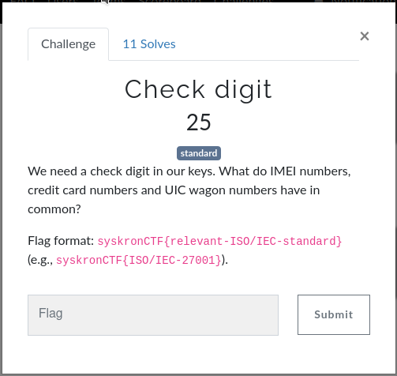

# Stolen Licenses

 

 

## Details


I'll start by say that this was a tough challenge, especially given it was only worth 300 Points!

With that in mind, I didn't really start making any progress with it until i'd unlocked a couple of hints, but I'll walk you through the process I took to get there.

I started as it suggested by downloading the "**license.zip**" file from the linked download site, using the password provided.

Once downloaded, trying to extract the zip file shows the file is password protected and so I set about trying to crack it as the challenege details suggest.

First i run "**zip2john**" to extract the hash from the zip file. 

The output from this command shows us that the zip file contains 1000 image files so I've cut out most of the output;

```
[jaxigt@MBA stolen_licenses]$ zip2john licenses.zip >zipfile.hash                       
licenses.zip/img/ is not encrypted!
ver 2.0 licenses.zip/img/ is not encrypted, or stored with non-handled compression type
ver 2.0 licenses.zip/img/B999582-0001.png PKZIP Encr: cmplen=166589, decmplen=169105, crc=7DA4BFEE
ver 2.0 licenses.zip/img/B999582-0002.png PKZIP Encr: cmplen=167001, decmplen=169545, crc=665E2878
...
.
ver 2.0 licenses.zip/img/B999582-0999.png PKZIP Encr: cmplen=167114, decmplen=169580, crc=C60B117C
ver 2.0 licenses.zip/img/B999582-1000.png PKZIP Encr: cmplen=166561, decmplen=169031, crc=916E6193
NOTE: It is assumed that all files in each archive have the same password.
If that is not the case, the hash may be uncrackable. To avoid this, use
option -o to pick a file at a time.
```

Likewise, cat'ing the hash file shows a huge hash key so i've just copied the last couple of lines which show the important info;

```
08ae81a67c1d412301f7311bf82eb278ae05e4db28071564a4741653d2ffc39547bcbd7bb3859a99c15f1550b63d665508798c12a6164e18549ca98b7a*$/pkzip2$::licenses.zip:img/B999582-0055.png, img/B999582-0001.png, img/B999582-0002.png:licenses.zip
```

Here we can see we're dealing with a "**pkzip2**" file. Hashcat does not currently support PKZip2 hashes so we'll need to stick with "**JTR**".

Next I tried a dictionary attack with "**john**" using "**rockyou.txt**" to no avail.

```[jaxigt@MBA stolen_licenses]$ john --wordlist=/usr/share/wordlists/rockyou.txt zipfile.hash
Using default input encoding: UTF-8
Loaded 1 password hash (PKZIP [32/64])
Will run 4 OpenMP threads
Press 'q' or Ctrl-C to abort, almost any other key for status
0g 0:00:00:01 DONE (2020-10-25 01:59) 0g/s 12470Kp/s 12470Kc/s 12470KC/s !joley08!..*7¡Vamos!
Session completed
```

I even tried some hybrid and brute force cracking, but with still no progress, this is where i came unstuck an needed to use one the availble hints.


Ok so with this new information we have a new angle of attack. I could have just skimmed down the page and create a wordlist manually using the new words but I'm a bit lazy so i used "**cewl**" to do it for me;

```
[jaxigt@MBA stolen_licenses]$ cewl -d 1 -m 6 https://www.merriam-webster.com/words-at-play/new-words-in-the-dictionary >passwords.txt
```

Using this new wordlist we try "**JTR**" again this time with a simple rule list applied to vary case, capitalisation etc;

```
[jaxigt@MBA stolen_licenses]$ john --wordlist=passwords.txt --rules=single zipfile.hash 
Using default input encoding: UTF-8
Loaded 1 password hash (PKZIP [32/64])
Will run 4 OpenMP threads
Press 'q' or Ctrl-C to abort, almost any other key for status
nosocomephobia   (licenses.zip)
1g 0:00:00:00 DONE (2020-10-25 02:10) 100.0g/s 819200p/s 819200c/s 819200C/s Dictionary..yarner
Use the "--show" option to display all of the cracked passwords reliably
Session completed
```

Within a few seconds we have the password! - **nosocomephobia**

Now we can unzip the files and finaly get to the real work on this challenge.

Looking at the files in the "***extracted img folder***" we can see 100 images all very simlar to the one below, but each with a "**unique serial**" and "**activation code**";


So now we have to challenges.

1. How to extract the data from each file (we cant manually copy it out of 1000 files)!
2. How do we know which keys are valid?

To resolve the first, we will need to use some sort of OCR, but for the secode, I needed another hint.


Hmm... at first this seemsed fairly unhelpful, but if we refer to an earlier challenge "**Check digit**" (one of the simple Trivia catagory ones) we are reminded of the below;



The detailed answer to that challenge can be found in it's writeup, but the method implemented is "**ISO/IEC 7812**" and with a bit of further Googling it is revealed that under this standard "**check digits**" are calcuated calculated using the "**Luhn algorithm**"

We'll come back to teh Luhn algorithm later but furst lest start writing some code to do what we need.

First we'll try a python OCR library to open an image and try to read the text from it;

```python
import sys
import tesserocr
from PIL import Image

image_file = sys.argv[1]

image = Image.open(image_file)
print(tesserocr.image_to_text(image))
```

runnig this code we can see that it does indeed perform some OCR on the image but hasn't managed to extract any of the important data we needed.

```
[jaxigt@MBA stolen_licenses]$ python ocr.py img/B999582-0001.png 
libpng warning: iCCP: known incorrect sRGB profile
R i

SW serial number

activation key

only valid if purchased together with a machine


``` 

A bit more research online and we find a stack overflow post in relation to a similar OCR python library [https://stackoverflow.com/questions/55994807/pytesseract-fail-to-recognise-digits-from-image](https://stackoverflow.com/questions/55994807/pytesseract-fail-to-recognise-digits-from-image) suggested adding the following code to optimise the processsing of the image;

```python
import cv2
from PIL import Image

img = cv2.imread('gradient.png')
# If your image is not already grayscale :
# img = cv2.cvtColor(img, cv2.COLOR_BGR2GRAY)
threshold = 180 # to be determined
_, img_binarized = cv2.threshold(img, threshold, 255, cv2.THRESH_BINARY)
pil_img = Image.fromarray(img_binarized)
```

The updated code now looks like this;

```python
import sys
import cv2
import tesserocr
from PIL import Image

image_file = sys.argv[1]

img = cv2.imread(image_file)
img = cv2.cvtColor(img, cv2.COLOR_BGR2GRAY)
threshold = 180 # to be determined
_, img_binarized = cv2.threshold(img, threshold, 255, cv2.THRESH_BINARY)
pil_img = Image.fromarray(img_binarized)

print(tesserocr.image_to_text(pil_img))
```

Running this new code we now see an improved OCR output;

```
[jaxigt@MBA stolen_licenses]$ python ocr.py img/B999582-0001.png 
L I IV TR WAL

 

)
) =
SW serial number .

B999582-0001

o)V [ufe] sl 5%

78121994415279564775

' 4

 

e Ui


```

Here we can see the serial key listed in the output.

Next we need to add and tweak some code to extract the key from the output using "**regular expressions**.; 

A quick look through some of the image files confirms that they all begin with the same sequence of numbers (7812...), so lets use that to find the string we wish to extract;

```python
import sys
import cv2
import re
import tesserocr
from PIL import Image

image_file = sys.argv[1]

img = cv2.imread(image_file)
img = cv2.cvtColor(img, cv2.COLOR_BGR2GRAY)
threshold = 180 # to be determined
_, img_binarized = cv2.threshold(img, threshold, 255, cv2.THRESH_BINARY)
pil_img = Image.fromarray(img_binarized)

img_ocr_data = tesserocr.image_to_text(pil_img)
pattern = r"^7812\d+"
multiline = re.compile(pattern, re.MULTILINE)
license_key = multiline.findall(img_ocr_data)

print(license_key[0])
```

Now when we run the script we see just the license key in the output;

```
[jaxigt@MBA stolen_licenses]$ python ocr.py img/B999582-0001.png 
78121994415279564775
```

So now we need to make it perfom this function on every file in the "**img**" directory.

```python
import sys
import cv2
import re
import os
import tesserocr
from PIL import Image

dir_path = sys.argv[1]

for file_name in os.listdir(dir_path):

    img = cv2.imread(dir_path + "/" + file_name)
    img = cv2.cvtColor(img, cv2.COLOR_BGR2GRAY)
    threshold = 180 # to be determined
    _, img_binarized = cv2.threshold(img, threshold, 255, cv2.THRESH_BINARY)
    pil_img = Image.fromarray(img_binarized)

    img_ocr_data = tesserocr.image_to_text(pil_img)
    pattern = r"^7812\d+"
    multiline = re.compile(pattern, re.MULTILINE)
    license_key = multiline.findall(img_ocr_data)

    print(license_key[0])

```

This works perfectly, but i stop it before it processes the 1000 files in the directory!

```
[jaxigt@MBA stolen_licenses]$ python ocr.py /home/jaxigt/ctf/syskron/stolen_licenses/img
78123683757359944769
78124972664118984564
78129129384587213955
78129529239355741238
78127895886947342345
78123422121896614143
78129543851214852447
78129631245481594161
^CTraceback (most recent call last):
  File "ocr.py", line 18, in <module>
    img_ocr_data = tesserocr.image_to_text(pil_img)
KeyboardInterrupt
```

Ok, so the final piece of the puzzle is running the "**Lunh algorithm**" check to determine if the keys are valid.

I must admit i spent some time trying various PyPi implementations which didn't work correctly before stubling aggross this site - [https://www.geeksforgeeks.org/luhn-algorithm/](https://www.geeksforgeeks.org/luhn-algorithm/).

Not only did it explain in an an easy to follow way how the algorithm works... but also helpfully included some code for us to implement it into our script!

I added the code and our python script now looks like this;

```python
import sys
import cv2
import re
import os
import tesserocr
from PIL import Image

dir_path = sys.argv[1]

i=0
j=0

def verifyLuhn(numberstring):
     
    nDigits = len(numberstring)
    nSum = 0
    isSecond = False
     
    for i in range(nDigits - 1, -1, -1):
        d = ord(numberstring[i]) - ord('0')
     
        if (isSecond == True):
            d = d * 2
  
        nSum += d // 10
        nSum += d % 10
  
        isSecond = not isSecond
     
    if (nSum % 10 == 0):
        return True
    else:
        return False


for file_name in os.listdir(dir_path):
	
	i += 1
	#print("Opening file: " + file_name)

	img = cv2.imread(dir_path + file_name)
	img = cv2.cvtColor(img, cv2.COLOR_BGR2GRAY)
	threshold = 180 # to be determined
	_, img_binarized = cv2.threshold(img, threshold, 255, cv2.THRESH_BINARY)
	pil_img = Image.fromarray(img_binarized)

	img_ocr_data = tesserocr.image_to_text(pil_img)
	pattern = r"^7812\d+"
	multiline = re.compile(pattern, re.MULTILINE)
	license_key = multiline.findall(img_ocr_data)

	if verifyLuhn(license_key[0]):
		j += 1
		print("File (" + str(i) + " - " + str(file_name) + "): Contains a valid key: " + str(license_key))

print(str(i) + " Files checked / " + str(j) + " valid keys found!")
```

Running the script, which does take a bit of time (unsuprisingly, given its performing OCR on 1000 image files!) produces the below output;

```
[jaxigt@MBA stolen_licenses]$ python3 ocr.py /home/jaxigt/ctf/syskron/stolen_licenses/img/
File (288 - B999582-0112.png): Contains a valid key: ['78124512846934984669']
1000 Files checked / 1 valid keys found!

```

So there we have our flag (in a slightly different format this time): **78124512846934984669**
