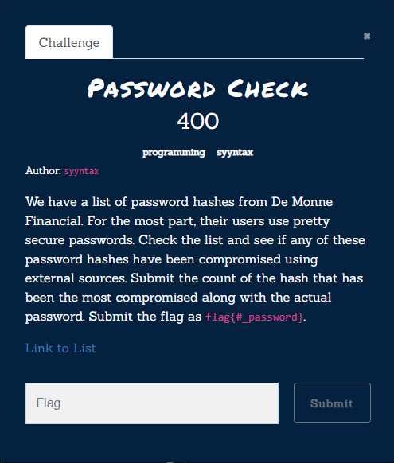

# [ Challenge Name ]
 

## Notes
Add images like this;



You can add Links like this [link to Google!](http://google.com)

### and Sub-headings

The code used can be seen below;
```python
if (isAwesome){
  return true
}
```


> "Quotes can be added like this"


Sometimes you want numbered lists:

1. One
2. Two
3. Three

Sometimes you want bullet points:

* Start a line with a star
* Profit!

Alternatively,

- Dashes work just as well
- And if you have sub points, put two spaces before the dash or star:
  - Like this
  - And this
  


 Tasks lists can also be used:

- [x] This is a complete item
- [ ] This is an incomplete item

When you include a task list in the first comment of an Issue, you will see a helpful progress bar in your list of issues.
